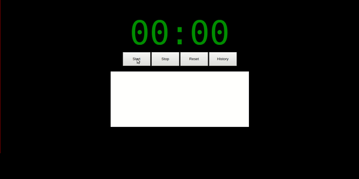
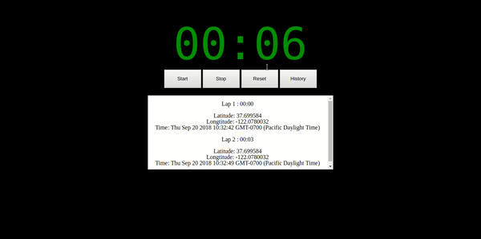

# ClickTimeTest

## Overview
<strong>"The Race Around the World"</strong>
 A coding challenge from ClickTime. Its a stopwatch web application consisting of a start/stop button and a history table. Each time the stopwatch starts, the application inserts a new row into the history table that records the start time, and the current latitude and longitude. When the stopwatch, the application will record the time, latitude, and longitude, as well as the amount of time that has elapsed.

## Demo 

## Technologies Used
Javascript
localStorage
Geolocation